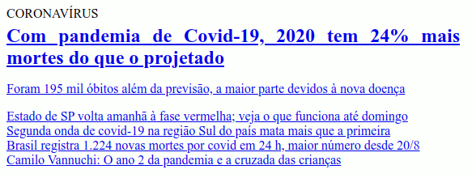

# Lista de exercícios de CSS3

## Orientações
- Esta lista de exercícios está em desenvolvimento, poderá mudar com o tempo
- O código com as soluções pretendidas está disponível neste mesmo repositório, em cada exercício há o HTML com a versão resolvido.html e o naoresolvido.html, a diferença entre eles é o carregamento ou não da solução em CSS
- A proposta de resolução dos exercícios é **NÃO ALTERAR A ESTRUTURA DO HTML**, fazendo uso dos seletores adequados do CSS
---

## Questões

**Considere a seguinte imagem e [este HTML](exemplos/01/naoresolvido.html) para as próximas questões.**

1. Formate a palavra "Coronavirus" para que seja exibido em maiúsculo (lembre-se que são exercícios de CSS!);
2. Formate o link de destaque para que o texto obtenha o alinhamento justificado;
3. Ajuste as margens do h1, para reduzir o tamanho padrão;
4. Retire o marcador do LI;
5. Retire a formatação de alinhamento e espaçamento do UL;

**Considere a seguinte imagem e [este HTML](exemplos/02/naoresolvido.html) para as próximas questões.**

6. Retire o sublinhado de todos os links;
7. O texto "Coronavirus" no link de destaque deve:
7.1. Ter a cor `#b81919` normalmente;
7.2. Ter a cor `#222222` quando o mouse estiver em cima;
8. Formate a cor dos links para `#222222`;
9. A tag P dentro do link de destaque deverá ter a cor `#555555`;
10. Ao passar o mouse por cima de um link, ele deve mudar de cor para `#b81919`;
11. Altere o tamanho da fonte do H1 no link de destaque para o tamanho `2rem`;
12. Aumente o espaçamento superior e inferior entre os elementos LI (aproximadamente `0.3rem`);
13. Formate a borda esquerda do LI para que tenha uma representação semelhate ao da figura (utilize a cor `#b81919`);
14. Não esqueça de distanciar o link envolvido na questão anterior da borda;

**Considere a seguinte imagem, [este HTML](exemplos/03/naoresolvido.html) e [este CSS base](03/css/base.css) para as próximas questões.**

15. Deixe as bordas das figuras arredondadas;
16. Force o H2 na área de "notica-reduzida" a não ter negrito;
17. Force as imagens a terem apenas `280px` de largura;
18. Force a largura da manchete para 50% do espaço disponível;
19. Faça com que as notícias fiquem uma ao lado da outra, distanciadas uma da outra;
20. Distancie as notícias ampliadas das notícias reduzidas;
21. Acrescente uma linha de separação entre as notícias de cima para as de baixo, tentando deixar a distância da linha igual para ambas as notícias;

*Notícias retiradas do [Portal UOL](https://www.uol.com.br/)*